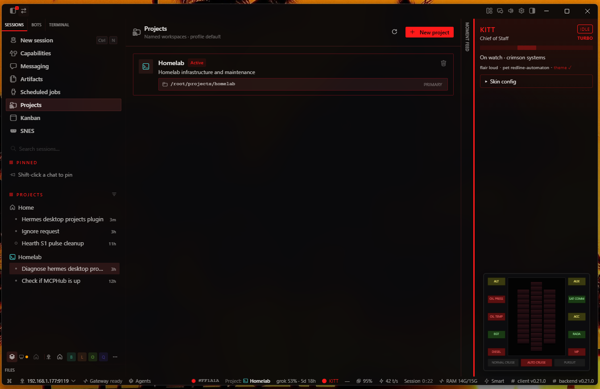
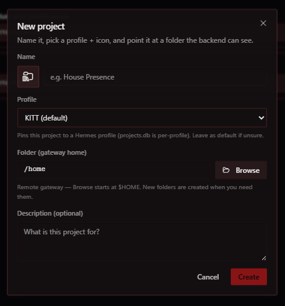
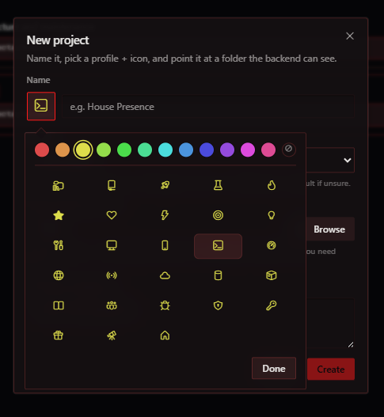
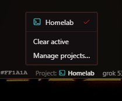
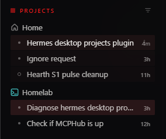

# hermes-projects-manager

Desktop plugin for [Hermes Agent](https://hermes-agent.nousresearch.com/) that adds a **Projects** manager UI: create/edit named workspaces, pin them to a Hermes **profile**, set icon & color, manage folders (including remote gateway paths), and keep the sidebar project tree in sync.

No extra backend service. It uses stock Hermes `projects.*` gateway RPCs and `projects.db` (same store as `hermes project` / Desktop “Grouping → Project”).

## Screenshots

### Projects manager

List projects, primary folder, Active badge, and trash on the row. Open via top nav, status-bar chip, or command palette.



### New / Edit project (popover closed)

- **Name row:** icon trigger on the **left** of the name field  
- **Profile** select (per-profile `projects.db`; leave as **default** / KITT if unsure)  
- Folder (Browse), optional description  
- Appearance opens as a **floating Popover** (does not grow the modal)



### Appearance popover (icon + color)

Click the glyph beside the name. Panel floats over the dialog:

1. **Color swatches** on top (live-tints every icon below)  
2. Separator  
3. **5-column** icon grid  
4. **Done** — or pick an icon to apply and close  



### Status bar picker

Click the status-bar chip to switch active project, clear active, or open Manage.



### Sidebar grouping

Stock **Grouping → Project** shows sessions under the project once cwd matches a project folder.



> **Note:** `02` and `05` reflect the current New project + appearance Popover UX (2026-09-04). `01` / `03` / `04` are still valid for list, status chip, and sidebar grouping.

## Requirements

- Hermes Desktop that loads **disk plugins**
- Hermes backend (local or remote) with Projects support (`projects.list`, `projects.create`, `projects.update`, `projects.add_folder`, …)
- Desktop build that exports SDK **`Popover`** (used for the floating appearance panel)
- For remote Desktop: folder paths must exist on the **gateway host** (not only the PC)

## Install

1. Copy this folder into Desktop’s disk plugins directory as `projects-manager`:

| OS | Path |
|----|------|
| Windows | `%LOCALAPPDATA%\hermes\desktop-plugins\projects-manager\` |
| macOS | `~/Library/Application Support/hermes/desktop-plugins/projects-manager/` |
| Linux | `~/.config/hermes/desktop-plugins/projects-manager/` (or your Desktop data dir) |

2. Ensure the folder contains at least:

```text
projects-manager/
  plugin.js
```

3. In Desktop: **⌘/Ctrl+K → Reload desktop plugins** (or restart Desktop).

4. Open **Projects** from the top nav, status-bar chip, or command palette (“Projects — manage workspaces”).

### Status bar project picker

The right status-bar chip is a **project picker**:

- No active project → shows **Projects**
- Active project → **`Project:`** + colored icon + name
- Click → popup of all projects (check marks the active one)
- **Clear active** / **Manage projects…** at the bottom of the menu

> **Remote mode note:** Disk plugins load on the **Desktop client machine**, not on the remote LXC/VPS `~/.hermes/desktop-plugins/`. Put `plugin.js` where the PC app reads plugins.

## What it does

- List / create / edit / delete (or archive) named projects
- **Profile pin** — on create/edit, choose which Hermes profile owns the project (`projects.db` is **per-profile**). Unset → stock **`default`**. Changing profile on edit **migrates** the project record (create on target + delete source)
- **Status-bar project picker** (set/clear active project; jump to Manage)
- **Appearance** — glyph left of the name field; floating Popover with colors + 5-col icon grid (live color tint); Done or pick-icon to close
- Multi-folder projects: add, set primary, detach (files on disk are never deleted)
- Remote folder browser starting at gateway `$HOME` (creates subdirs on demand)
- Local gateway: native folder dialog when Desktop is in local mode
- Nudges sidebar project-tree refresh after appearance/folder changes

## Usage tips

- **Click a project row** → edit modal
- **Trash icon** (top-right of row, icon-only) → delete project record only; sessions stay, they just ungroup
- **Move sessions** between projects: session row ⋯ → **Move to project** (stock Desktop)
- Removing a folder from a project does **not** rewrite existing session `cwd`s — use Move to project if chats stay under an old path
- List/status chip follow the **active Desktop profile**; use the form’s Profile field to write into another profile’s `projects.db`

## Memory & context boundaries

**Projects are not a separate memory bank.** They do not open their own Mnemosyne database, swap `SOUL.md`, or wall off profile memory when you switch. What they change is **where sessions live (cwd)** — and **cwd** is how Hermes pulls project instructions from disk.

### What actually isolates

| Layer | What it scopes | Project-related? |
|--------|----------------|------------------|
| **Profile** (`default`, named bots, …) | Own `$HERMES_HOME`: SOUL, MEMORY/USER, Mnemosyne, **`projects.db`**, skills | Projects are **per profile** |
| **Session** | That chat’s transcript / tool history | Sessions **group under** a project by cwd; deleting a project does not delete sessions |
| **Workspace cwd** | Terminal, file tools, which context files load | **Yes — main path for “project knowledge”** |
| **Git root** | `.hermes.md` parent walk stops here | Repo boundary so home-level rules don’t leak into every repo |

### How to give a project durable instructions (from disk)

Put context files **inside the project folder** (the path you attached in Projects). When a session’s cwd is under that folder, Hermes can load them into the system prompt:

| File | Typical use |
|------|-------------|
| **`.hermes.md`** or **`HERMES.md`** | Hermes-specific rules; walks parents up to the **git root** |
| **`AGENTS.md`** (or `agents.md` / override variants) | Portable agent instructions (Hermes + other tools) |
| **`CLAUDE.md`** / **`.cursorrules`** | Same idea, other tool flavors — Hermes may pick one project-context source |
| Optional **`IDEA.md`** | Short project brief some create flows write — **not** identity (`SOUL.md`) |

**Tips:**

- Prefer **folder rules** over relying only on the project’s UI description field.
- Don’t put project rules in `~/.hermes/AGENTS.md` expecting them to apply everywhere — that’s cwd-scoped, not global. Cross-project identity stays in **`SOUL.md`** (profile) or skills.
- **Active project** is a bookmark (status bar / agent “which is active”). It does **not** by itself sandbox long-term memory or force every new chat into that project unless the UI scope/cwd says so.
- Profile memory (Mnemosyne, MEMORY.md, etc.) remains **profile-scoped** unless you deliberately design otherwise.

Official Hermes docs: [project context files](https://hermes-agent.nousresearch.com/docs) (search “AGENTS.md” / project context) and the bundled `project-context-files` skill reference in the agent tree.

## Portability

Defaults resolve gateway `$HOME` at runtime (`/root`, `/home/you`, …). No required `~/projects` directory — subfolders are created when you ask. No house-specific paths or companion services required.

## Development

Single file: `plugin.js` (Hermes Desktop runtime plugin — ESM, imports from `@hermes/plugin-sdk`).

After edits: copy to the Desktop plugins path and **Reload desktop plugins**.

Public repo: https://github.com/drewdah/hermes-projects-manager

## Changelog (high level)

- **Profile pin** on create/edit (default profile when unset; migrate on edit)
- **Appearance** glyph left of name; Popover floats color + icon grid over the modal
- Status-bar project picker; row click → edit; trash icon-only

## License

MIT
